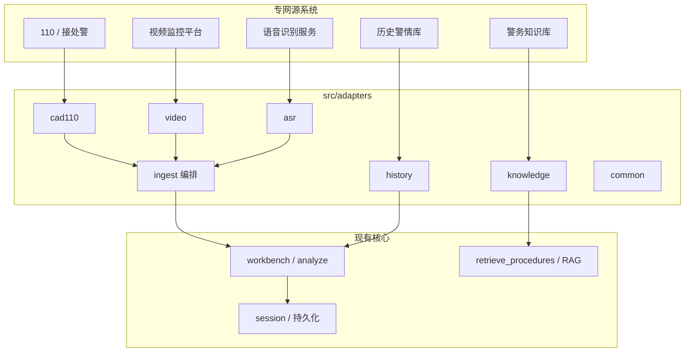

# 专网多源接入 · Adapter 与内部 API 规格（完整草案）

> 用途：答辩/设计说明/联调清单。与当前仓库「文本研判 + 可选 RAG」兼容：所有外部系统先归一为 `CanonicalIncident`，再进入现有 `analyze_incident` / `analyze_alarm` 链路。  
> 约定：下文 **内部 API** 指专网内服务间接口，前缀 `/internal/v1`；与面向工作台演示的 `/api/*` 分离。

---

## 1. 文档控制

| 项 | 说明 |
|----|------|
| 版本 | v0.2 草案 |
| 适用范围 | 公安信息网 / 政务外网 / 视频专网等 **非互联网暴露** 环境 |
| 非目标 | 公网开放订阅、互联网用户直连原始警情库 |

---

## 2. 术语

| 术语 | 含义 |
|------|------|
| **源系统** | 110 接处警、视频监控、知识库、历史库、ASR 等 |
| **Adapter** | 协议转换、字段映射、鉴权、重试、审计落点 |
| **CanonicalIncident** | 警擎内部统一警情对象（研判与存储的主键语义） |
| **Ingest** | 接入、校验、去重、合并、持久化、触发研判 |
| **Upstream** | 源系统或经网闸/前置机暴露的北向接口 |

---

## 3. 总体架构



**原则**

1. **北向多样、南向统一**：各 Adapter 只面向源系统协议；**仅 `ingest` 产出 `CanonicalIncident`**。  
2. **研判无直连外系统**：分析模块只消费 Canonical + 检索上下文，不持有对方 SDK。  
3. **可异步**：语音转写、视频摘要允许 Job 模式；研判可 `pending → ready`。

---

## 4. 建议代码目录（与仓库对齐的可落地方案）

```
src/
  adapters/
    __init__.py
    common/
      __init__.py
      canonical.py          # CanonicalIncident 模型与校验
      errors.py             # 错误码与异常类型
      http_client.py        # 专网 HTTP：超时、mTLS、签名头
      logging_audit.py      # 结构化审计日志
      redact.py             # 脱敏规则
    cad110/
      client.py             # 调用对方北向 API（若需主动拉单）
      mapper.py             # 对方 JSON → Canonical 补丁
      webhook_handler.py    # 接收对方推送（若在 api_server 注册路由）
    video/
      client.py
      mapper.py
      webhook_handler.py
    knowledge/
      client.py             # 知识库检索（或封装现有 RAG 数据源）
    history/
      client.py
      mapper.py
    asr/
      client.py             # 创建任务 / 查询结果
    ingest/
      service.py            # merge、去重、持久化、触发 analyze
      repository.py         # Canonical 存储抽象（内存/DB 实现可插拔）
```

**与 `api_server.py` 的关系（建议）**

- `/api/*`：保持演示与现有前端。  
- `/internal/v1/*`：**新蓝图**，专网网关或兄弟服务反代；生产可单独进程。

---

## 5. CanonicalIncident（完整字段草案）

### 5.1 顶层

| 字段 | 类型 | 必填 | 说明 |
|------|------|------|------|
| `schema_version` | string | 是 | 如 `1.0.0` |
| `canonical_incident_id` | uuid | 否 | ingest 生成后回填 |
| `created_at` | datetime RFC3339 | 是 | 首次进入警擎时间 |
| `updated_at` | datetime RFC3339 | 是 | 最后合并更新时间 |
| `ingest_status` | enum | 是 | 见 §5.5 |
| `analyze_status` | enum | 是 | `none` \| `queued` \| `running` \| `succeeded` \| `failed` |
| `structured` | object | 是 | §5.2 |
| `unstructured` | object | 是 | §5.3 |
| `attachments` | array | 否 | §5.4 |
| `visual` | object | 否 | 视频侧摘要 |
| `rag_hints` | object | 否 | 检索提示（辖区、警种、关键词） |
| `external_refs` | array | 是 | 多源溯源 |
| `audit` | object | 是 | §5.6 |

### 5.2 `structured`

| 字段 | 类型 | 必填 | 说明 |
|------|------|------|------|
| `alarm_no` | string | 条件 | 有则全局唯一（业务主键之一） |
| `received_at` | datetime | 否 | 接警时间 |
| `location_text` | string | 否 | 人类可读地址 |
| `geo` | object | 否 | `{ "lat", "lon", "coord_sys": "WGS84|GCJ02|..." }` |
| `jurisdiction` | string | 否 | 分局/派出所代码 |
| `category_code` | string | 否 | 对方警情类别码 |
| `category_text` | string | 否 | 类别中文 |
| `priority` | int | 否 | 数字越小越紧急（团队内约定） |
| `operator_id` | string | 否 | 接警员工号（脱敏存储策略见 §10） |

### 5.3 `unstructured`

| 字段 | 类型 | 必填 | 说明 |
|------|------|------|------|
| `alarm_text` | string | 条件 | 与 ASR 至少其一非空（可扩展校验） |
| `asr_text` | string | 否 | 完整转写 |
| `asr_locale` | string | 否 | 如 `zh-CN` |
| `caller_profile` | object | 否 | 允许空对象；禁止明文身份证等 |

### 5.4 `attachments[]`

| 字段 | 类型 | 必填 | 说明 |
|------|------|------|------|
| `attachment_id` | uuid | 是 | 内部 ID |
| `source_system` | string | 是 | `cad110` \| `video` \| `other` |
| `media_type` | enum | 是 | `image` \| `video` \| `audio` \| `file` |
| `ref_type` | enum | 是 | `url` \| `object_key` \| `binary_id` |
| `ref_value` | string | 是 | 专网可达地址或对象存储键 |
| `captured_at` | datetime | 否 | 采集/告警时间 |
| `sha256` | string | 否 | 完整性校验 |
| `metadata` | object | 否 | 摄像头 ID、通道、厂商告警码等 |

### 5.5 `ingest_status`

| 值 | 含义 |
|----|------|
| `draft` | 仅部分字段，未满足最小研判条件 |
| `ready` | 满足最小条件，可研判 |
| `merged` | 多源合并后的稳定态 |
| `closed` | 业务结案，拒绝再自动合并（可选） |

### 5.6 `audit`

| 字段 | 类型 | 说明 |
|------|------|------|
| `source_payload_hash` | string | SHA256，不存原文时可对账 |
| `adapter_versions` | map | 如 `{ "cad110": "1.2.0" }` |
| `pii_policy` | string | 使用的脱敏策略版本 |

### 5.7 示例（最小可研判）

```json
{
  "schema_version": "1.0.0",
  "created_at": "2026-04-11T02:07:32Z",
  "updated_at": "2026-04-11T02:07:32Z",
  "ingest_status": "ready",
  "analyze_status": "none",
  "structured": {
    "alarm_no": "202604110001",
    "received_at": "2026-04-11T02:05:00+08:00",
    "location_text": "朝阳区三里屯",
    "jurisdiction": "11010501",
    "category_code": "0100"
  },
  "unstructured": {
    "alarm_text": "有人打架，有人持刀，请尽快到场。"
  },
  "attachments": [],
  "external_refs": [
    { "system": "cad110", "id": "202604110001", "role": "primary" }
  ],
  "audit": {
    "source_payload_hash": "…",
    "adapter_versions": { "cad110": "0.1.0" },
    "pii_policy": "default-v1"
  }
}
```

---

## 6. 横切能力

### 6.1 幂等与去重

- **请求头**：`Idempotency-Key: <uuid>`（写入类接口必填）。  
- **业务键**：优先 `alarm_no`；无编号时用 `(source_system, external_id)`；再不行用 `source_payload_hash` 短窗去重。

### 6.2 错误模型（统一 JSON）

```json
{
  "error": {
    "code": "INGEST_DUPLICATE",
    "message": "同一 alarm_no 在 300s 内已接入",
    "request_id": "req-uuid",
    "details": {}
  }
}
```

**错误码表（节选）**

| HTTP | code | 说明 |
|------|------|------|
| 400 | `VALIDATION_FAILED` | Canonical / 补丁校验失败 |
| 401 | `UNAUTHORIZED` | 鉴权失败 |
| 403 | `FORBIDDEN` | 无辖区或角色权限 |
| 404 | `NOT_FOUND` | 资源不存在 |
| 409 | `INGEST_DUPLICATE` | 幂等或业务冲突 |
| 422 | `INGEST_INCOMPLETE` | 缺必填字段，入 `draft` |
| 429 | `UPSTREAM_RATE_LIMIT` | 上游限流 |
| 502 | `UPSTREAM_UNAVAILABLE` | 上游超时/故障 |
| 503 | `SERVICE_UNAVAILABLE` | 本服务过载 |

### 6.3 分页（列表类）

**Query**：`cursor`（opaque）、`limit`（默认 20，最大 100）。  
**Response**：`{ "items": [], "next_cursor": "…" }`。

### 6.4 API 版本

- 路径版本：`/internal/v1`。  
- **可选头**：`Accept-Version: 2026-04-11` 用于灰度；不送则默认 v1 语义。

---

## 7. 内部 REST API 全表（草案）

> 鉴权：**`Authorization: Bearer <服务令牌>`** 与/或 **mTLS**；**`X-Request-Id`** 全链路透传；**`X-Caller-Service`** 登记调用方系统名。

### 7.1 健康

| 方法 | 路径 | 说明 |
|------|------|------|
| GET | `/internal/v1/health` | 存活 |
| GET | `/internal/v1/health/ready` | 依赖就绪（DB、向量库可选） |
| GET | `/internal/v1/health/upstream` | 可选：只读 ping 各 Adapter（注意频率与熔断） |

### 7.2 接入（Ingest）

| 方法 | 路径 | 说明 |
|------|------|------|
| POST | `/internal/v1/ingest/cad110` | 110 警情单整包接入 |
| POST | `/internal/v1/ingest/video-alert` | 视频告警接入 |
| POST | `/internal/v1/ingest/patch` | 对已有 `canonical_incident_id` 打补丁合并 |
| POST | `/internal/v1/ingest/merge` | 按 `alarm_no` 或 `external_refs` 自动合并 |
| GET | `/internal/v1/incidents` | 列表（筛选：`status`、`jurisdiction`、`from`、`to`） |
| GET | `/internal/v1/incidents/{canonical_incident_id}` | 详情 |
| GET | `/internal/v1/incidents/by-alarm-no/{alarm_no}` | 按警情编号 |

**`POST /ingest/cad110` 请求体（草）**

```json
{
  "external_id": "CAD-202604110001",
  "payload": {
    "alarm_no": "202604110001",
    "received_at": "2026-04-11T10:05:00+08:00",
    "location_text": "朝阳区三里屯",
    "category_code": "0100",
    "alarm_text": "…",
    "recording_id": "REC-xxx"
  }
}
```

**响应**

```json
{
  "canonical_incident_id": "ci-uuid",
  "ingest_status": "ready",
  "analyze_status": "none"
}
```

**`POST /ingest/video-alert` 请求体（草）**

```json
{
  "external_id": "VMS-ALERT-998877",
  "payload": {
    "camera_id": "CAM-001",
    "alert_at": "2026-04-11T10:06:00+08:00",
    "alert_type": "intrusion",
    "snapshot": {
      "ref_type": "object_key",
      "ref_value": "vms/snap/998877.jpg"
    },
    "related_alarm_no": "202604110001"
  }
}
```

**`POST /ingest/patch` 请求体（草）**

```json
{
  "canonical_incident_id": "ci-uuid",
  "patch": {
    "unstructured": { "asr_text": "转写全文…" },
    "attachments": [
      {
        "attachment_id": "new-uuid",
        "source_system": "cad110",
        "media_type": "audio",
        "ref_type": "object_key",
        "ref_value": "cad/rec/REC-xxx.wav"
      }
    ]
  },
  "merge_policy": "replace_non_null"
}
```

### 7.3 研判触发（与现有逻辑衔接）

| 方法 | 路径 | 说明 |
|------|------|------|
| POST | `/internal/v1/incidents/{canonical_incident_id}/analyze` | 同步或入队研判 |
| GET | `/internal/v1/incidents/{canonical_incident_id}/analyze/latest` | 最近一次分析结果摘要 |
| GET | `/internal/v1/jobs/{job_id}` | 异步任务状态（若实现队列） |

**`POST .../analyze` 请求体（草）**

```json
{
  "use_rag": true,
  "mode": "sync",
  "rag_overrides": {
    "jurisdiction": "11010501",
    "extra_query": "持刀 打架"
  }
}
```

**`mode`**

| 值 | 行为 |
|----|------|
| `sync` | HTTP 内完成，返回与现 `/api/analyze` 类似结构 |
| `async` | 返回 `job_id`，客户端轮询 `GET /jobs/{job_id}` |

**成功响应（sync，草）**

```json
{
  "canonical_incident_id": "ci-uuid",
  "analysis_id": "…",
  "elapsed": 1.24,
  "result": {},
  "markdown": "…"
}
```

### 7.4 知识库（供 RAG 或预取）

| 方法 | 路径 | 说明 |
|------|------|------|
| GET | `/internal/v1/knowledge/search` | Query：`q`,`jurisdiction`,`doc_types`,`top_k` |
| GET | `/internal/v1/knowledge/docs/{doc_id}` | 元数据（不含大正文时可截断） |

### 7.5 历史警情库

| 方法 | 路径 | 说明 |
|------|------|------|
| GET | `/internal/v1/history/incidents/{alarm_no}` | 只读详情 |
| POST | `/internal/v1/history/similar` | 相似检索（向量/关键词由后端定） |

**`POST /history/similar` 请求体（草）**

```json
{
  "canonical_incident_id": "ci-uuid",
  "limit": 5,
  "filters": {
    "time_range": { "from": "2025-01-01", "to": "2026-04-11" },
    "jurisdiction": "110105"
  }
}
```

### 7.6 ASR

| 方法 | 路径 | 说明 |
|------|------|------|
| POST | `/internal/v1/asr/jobs` | 创建转写任务 |
| GET | `/internal/v1/asr/jobs/{job_id}` | 查询状态/文本 |
| POST | `/internal/v1/asr/jobs/{job_id}/attach` | 转写完成后挂到指定 `canonical_incident_id` |

**`POST /asr/jobs` 请求体（草）**

```json
{
  "recording_ref": { "ref_type": "object_key", "ref_value": "cad/rec/REC-xxx.wav" },
  "locale": "zh-CN",
  "callback_url": "https://plice.internal/internal/v1/asr/callback"
}
```

> 若专网禁止回调：省略 `callback_url`，仅轮询 `GET`。

### 7.7 媒体上传（语音 / 视频，已实现）

| 方法 | 路径 | 说明 |
|------|------|------|
| POST | `/internal/v1/uploads` | `multipart/form-data`：`file`、`kind=audio\|video`；可选 `canonical_incident_id`、`alarm_no`、`alarm_text`、`caption`（视频写入 `visual.summary`） |
| GET | `/uploads/<uuid>.<ext>` | 读取已上传文件（仅允许 32 位 hex 文件名 + 白名单后缀） |

文件写入 `UPLOAD_FOLDER`（默认 `data/uploads/`），并在警情上追加 `attachments[]`（`ref_type=url`）。

---

## 8. 可选：消息队列模式（与 REST 二选一或并存）

当 110/视频 **只支持 MQ 推送** 时，增加「消费适配层」，语义与 REST **等价**，仍落 `ingest.service`。

| 主题（示例） | 生产者 | 消费者 | 消息体 |
|-------------|--------|--------|--------|
| `cad110.incident.created` | 接处警 | `adapters.cad110` | 与 `POST /ingest/cad110.payload` 同形 |
| `cad110.incident.updated` | 接处警 | `adapters.cad110` | 补丁事件，映射到 `ingest/patch` |
| `vms.alert.raised` | 视频平台 | `adapters.video` | 与 `ingest/video-alert` 同形 |
| `asr.job.completed` | ASR | `adapters.asr` | `{ "job_id", "text", "confidence" }` |

**消费保证**：至少一次投递 → ingest 必须 **幂等**。

---

## 9. 与现有仓库能力的映射

| 现有能力 | 本规格中的位置 |
|----------|----------------|
| `POST /api/analyze` + `alarm_text` | 演示等价于 `ingest` 已简化为仅文本的 Canonical + `analyze` |
| `retrieve_procedures` / RAG | `knowledge/search` 或 `analyze` 前由 `ingest` 写入 `rag_hints` |
| `session_store` / history | 可逐步改为 `repository` 持久化 Canonical + 分析快照；API 可双写过渡期保留 |

---

## 10. 安全、合规与数据留存

| 项 | 建议 |
|----|------|
| 传输 | 专网内仍 **TLS**（内网证书）或 **mTLS** |
| 身份 | 服务账号 + 定期轮换；禁止长寿命明文密钥进仓库 |
| 最小权限 | 历史库、知识库 **只读账号**；写权限仅 ingest 服务 |
| 脱敏 | 手机号、身份证、车牌等按 `pii_policy` 规则落日志前脱敏 |
| 审计 | 每次 ingest/analyze 记：`request_id`、`caller`、`alarm_no`、`hash`、结果状态 |
| 留存 | 原始报文与附件：**对象存储 + 留存周期**（与法制部门约定） |

---

## 11. 配置清单（环境变量示例）

| 变量 | 说明 |
|------|------|
| `INTERNAL_API_TOKEN` | 内部 Bearer |
| `CAD110_BASE_URL` | 北向基址（若主动拉单） |
| `VMS_BASE_URL` | 视频开放平台基址 |
| `KB_SEARCH_URL` | 知识库检索入口 |
| `HISTORY_DB_DSN` | 历史库只读连接串 |
| `ASR_BASE_URL` | 语音服务基址 |
| `MTLS_CERT_PATH` / `MTLS_KEY_PATH` | 客户端证书（若启用） |

---

## 12. 联调与验收建议

1. **仿真源**：各 Adapter 对「录制的 JSON 样例」做契约测试（不连真实 110）。  
2. **最小闭环**：`ingest/cad110` → `analyze` sync → 返回 JSON 与 Markdown。  
3. **合并场景**：先 110 后视频告警，`merge` 后附件数与 `ingest_status=merged`。  
4. **故障注入**：上游 502 / 超时 / 重复投递，验证错误码与幂等。

---

## 13. 修订记录

| 版本 | 日期 | 说明 |
|------|------|------|
| v0.2 | 2026-04-11 | 完整草案首版（模块 + Canonical + REST + MQ + 横切） |
| v0.3 | 2026-04-11 | 仓库已落地：`src/adapters/*`、`/internal/v1` 蓝图；浏览器工作台通过语音上传等对接 internal（首页无独立「多源接入」Tab） |
| v0.4 | 2026-04-11 | 增加真实语音/视频 multipart 上传 `POST /internal/v1/uploads` 与 `GET /uploads/<file>` |

---

## 14. 后续可扩展（未写入详细 schema）

- `webhook` 入站与 **请求签名**（源系统时间戳 + HMAC）。  
- **辖区级多租户**：`tenant_id` 进 Canonical 与检索隔离。  
- **布控方案回写 110**（南向北向闭环，需单独流程与审批）。

如需把 §7 的接口 **真正注册到 `api_server.py`**，可另开任务单：先实现 `ingest` + 内存 `repository`，再挂 internal 蓝图。
